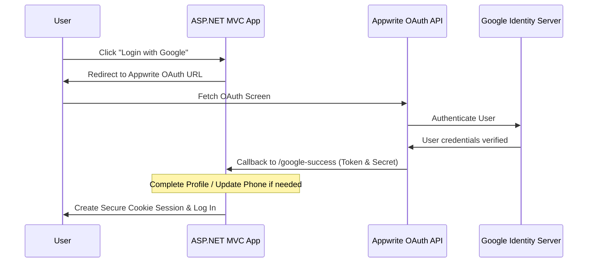

# Vanguard Engine - Week 2 Technical Master Document

This document serves as the **definitive technical reference guide** for all features, services, and databases implemented during **Week 2**. It explains exactly **where** each logic segment resides, **how** the execution flow works from A to Z, and **why** the architectural decisions were made.

---

## 1. Quick Cheat Sheet: "Where is the logic for X?"

If you are asked to locate specific features or operations implemented in Week 2, use this mapping cheat sheet:

### 🔐 Authentication & Verification
*   **Google OAuth 2.0 URL Generation** 👉 `Services/AuthService.cs` ➔ `GetOAuth2UrlAsync()`
*   **Google OAuth Callback Handler** 👉 `Controllers/AuthController.cs` ➔ `OAuthCallback()`
*   **Profile Completion for OAuth Users** 👉 `Views/Auth/CompleteProfile.cshtml` & `Controllers/AuthController.cs` ➔ `CompleteProfile()`
*   **Update Phone Interceptor** 👉 `Views/Auth/UpdatePhone.cshtml` & `Controllers/AuthController.cs` ➔ `UpdatePhone()`
*   **Email Verification Trigger (SMTP)** 👉 `Services/AuthService.cs` ➔ `RegisterAsync()` (triggers `EmailService.SendVerificationEmailAsync()`)
*   **Email Verification Endpoint** 👉 `Controllers/AuthController.cs` ➔ `VerifyEmail()`
*   **OTP Password Reset Trigger** 👉 `Controllers/AuthController.cs` ➔ `ForgotPassword()` (triggers `AuthService.ForgotPasswordAsync()`)
*   **OTP Verification & Expiry** 👉 `Controllers/AuthController.cs` ➔ `VerifyOtp()` (triggers `AuthService.ValidateResetOtpAsync()`)
*   **Password Update & Invalidation** 👉 `Controllers/AuthController.cs` ➔ `ResetPassword()` (triggers `AuthService.ResetPasswordAsync()`)

### 📋 Client Request Module
*   **Request Input Model & Validation** 👉 `Models/ClientRequestViewModel.cs`
*   **Form Submission & Database Storage** 👉 `Views/ClientRequest/Create.cshtml` & `Controllers/ClientRequestController.cs` ➔ `Create()` (POST)
*   **Client "My Requests" Panel** 👉 `Views/ClientRequest/MyRequests.cshtml` & `Controllers/ClientRequestController.cs` ➔ `MyRequests()`
*   **Client Request Cancellation** 👉 `Controllers/ClientRequestController.cs` ➔ `Cancel()` (POST)
*   **Admin Requests Control Board** 👉 `Views/ClientRequest/AdminRequests.cshtml` & `Controllers/ClientRequestController.cs` ➔ `AdminRequests()`

### 🎖️ Guard Assignment & Recruitment Workflow
*   **Active/Busy Roster State Tracker** 👉 `Entities/GuardApplication.cs` ➔ `GuardStatus` property
*   **Direct Guard Assignment (Admin)** 👉 `Views/ClientRequest/Assign.cshtml` & `Controllers/ClientRequestController.cs` ➔ `Assign()`
*   **Recruitment Jobs Board** 👉 `Views/ClientRequest/OpenJobs.cshtml` & `Controllers/ClientRequestController.cs` ➔ `OpenJobs()`
*   **Guard Job Application (Submit)** 👉 `Services/GuardApplicationService.cs` ➔ `ApplyToJobAsync()`
*   **Client Review & Accept/Reject** 👉 `Views/ClientRequest/MyRequests.cshtml` ➔ Accept/Reject forms (POST to `ClientRequestController`)
*   **Complete Contract & Release** 👉 `Controllers/ClientRequestController.cs` ➔ `Complete()` (POST) (triggers `GuardApplicationService.CompleteJobAsync()`)

---

## 2. Technical Deep Dive: Authentication & Verification Flows

### A. Google OAuth 2.0 Integration
Instead of manual API key handling, Google Auth uses Appwrite's built-in OAuth providers. Here is the step-by-step pipeline:



1.  **Redirection**: Clicking "Login with Google" triggers `AuthController.LoginWithGoogle()`. It queries `AuthService.GetOAuth2UrlAsync()`, which generates a redirection path to Appwrite's server endpoints.
2.  **Appwrite Intermediary**: Appwrite handles redirects to the Google login consent screen. After login, Google returns user identity tokens to Appwrite, which redirects the user back to `/google-success` (handled by `AuthController.GoogleSuccess()`).
3.  **Callback Processing**:
    *   The browser's JavaScript SDK reads the URL parameters (`userId` and `secret`) and relays them to `AuthController.OAuthCallback(userId, secret)`.
    *   The server uses its private Appwrite client to verify the user with `HandleOAuthCallbackAsync()`.
4.  **Profile Completion (New OAuth Users)**: If the user is logging in via Google for the first time, they are redirected to `CompleteProfile.cshtml` to select their system role (Client or Guard), enter their address, and set an optional password.
5.  **Phone Number Intercept (Returning OAuth Users)**: If the Google account registers successfully but has no phone number, the app intercepts the login flow and redirects them to `UpdatePhone.cshtml`. This prevents uncontactable users from accessing tactical dashboards.
6.  **Sign In**: Once completed, a secure C# Cookie session is generated via `HttpContext.SignInAsync` containing name, email, and role claims.

---

### B. SMTP Email Verification Flow
To secure local registrations, we enforce email verification:
1.  **Trigger**: When registering an account (`AuthController.Register`), we generate a secure token:
    ```csharp
    var verificationToken = Guid.NewGuid().ToString("N") + Guid.NewGuid().ToString("N");
    ```
2.  **Mail Dispatch**: The system inserts the user with `IsEmailVerified = false` and calls `EmailService.SendVerificationEmailAsync()`. This sends a customized HTML email containing a dynamic link:
    `http://<domain>/auth/verifyemail?userId=<ID>&token=<Token>`
3.  **Verification**: When clicked, the request hits `VerifyEmail(userId, token)`. If the token matches and is within the **24-hour expiration window**, `IsEmailVerified` updates to `true`.
4.  **Resending**: If the user tries to log in with an unverified account, they are blocked with an error banner that includes an automated link to resend the verification email.

---

### C. Password Reset OTP Engine
To prevent brute-force attacks and security vulnerabilities, password resets use a **6-Digit One-Time Password (OTP)**:
1.  **Request**: The user enters their email on `ForgotPassword.cshtml`.
2.  **OTP Generation**: The service generates a random 6-digit numeric string and sets a **15-minute expiration timestamp**:
    ```csharp
    var otp = new Random().Next(100000, 999999).ToString();
    var tokenExpiry = DateTime.UtcNow.AddMinutes(15);
    ```
3.  **SMTP Delivery**: The OTP is sent using `EmailService.SendPasswordResetOtpEmailAsync()`. The user is redirected to `VerifyOtp.cshtml`.
4.  **Client-Side Resend Control**: To prevent spamming the SMTP server, the Resend button has a **60-second javascript countdown throttle**.
5.  **Validation**: Entering the correct code authorizes the user to enter `ResetPassword.cshtml`. The old OTP is immediately invalidated (`ResetToken = null`) to prevent reuse.

---

## 3. Technical Deep Dive: Client Security Request System

The Client Security Request Module handles how clients request guard deployments, how recruiters review those requests, and how guards are assigned.

```
[ Client Request Created (Pending) ]
                 │
                 ▼
     [ Admin Reviews Post ]
                 │
        ┌────────┴────────┐
        ▼                 ▼
   [ Approved ]      [ Rejected ]
        │
        ▼
   [ Guard Applies or Admin Assigns ]
        │
        ▼
   [ Guard Deployed (Busy status) ]
        │
        ▼
   [ Complete Contract (Guards Released) ]
```

### A. Form Validation & Database Entry
1.  **Form Input**: The client inputs the deployment location, the number of guards needed, and the shift duration (Day Shift, Night Shift, or 24-Hour Duty) in `Views/ClientRequest/Create.cshtml`.
2.  **Validation**: `ClientRequestViewModel` enforces strict limits:
    *   `Location` cannot be empty and is sanitized.
    *   `NumberOfGuards` must be between **1 and 10** to prevent layout or operational overload.
    *   `Duration` must match one of the predefined shift options.
3.  **Storage**: The request is stored in the Appwrite `client_requests` collection with a status of `Pending`.

---

### B. Guard Assignment & Recruitment Workflow
This workflow coordinates requests, guard applications, and client assignments:

1.  **Hiring Notices (Admin/Recruiter)**: Admin/Recruiter approves client requests. Once approved, the request is published to the **Recruitment Jobs Board** (`Views/ClientRequest/OpenJobs.cshtml`).
2.  **Guard Eligibility Check**: Guards browse the board. The system queries their active status:
    *   If a guard's profile has `GuardStatus == "Busy"`, the "Apply" button is disabled and replaced with a warning badge.
    *   If the guard is `Available`, they can click apply. This creates a job application document containing the target `jobId` and `status = "Pending"`.
3.  **Client Selection (My Requests Screen)**:
    *   Under `MyRequests.cshtml`, the client sees their requests. If a guard has applied to a request, the client can view their name, years of experience, and license status.
    *   The client can click **Accept Application** or **Reject Application**.
4.  **Acceptance State Machine**:
    *   When the client accepts a guard, the system updates the application status to `Accepted`.
    *   The guard's global status updates to **`Busy`** (`GuardStatus = "Busy"`), which blocks them from applying for other assignments.
    *   The guard's user ID is added to the request's `AssignedGuardIds` array.
5.  **Guard Console (Current Work Section)**:
    *   The next time the guard logs into `Dashboard/Guard`, the system detects their active deployment.
    *   The terminal renders details about their shift: location, duration, and client details, along with a live **Check-In / Check-Out** widget.
6.  **Contract Completion & Release**:
    *   When the deployment contract ends, the Admin or Recruiter clicks **Complete Contract** on the requests panel.
    *   The request status updates to `Completed`.
    *   All guards assigned to that request are released back to **`Available`** status, allowing them to apply for new shifts immediately.

---

## 4. Database Schema Mappings

Here are the NoSQL document models mapping to Appwrite collections for Week 2 features:

### A. Client Request Document (`client_requests` collection)
| Attribute | Type | Description |
| :--- | :--- | :--- |
| `clientId` | String | User ID of the client who created the request |
| `numberOfGuards` | Integer | Total guards required for deployment |
| `location` | String | Sanitized address for guard duty |
| `duration` | String | Selected shift schedule (e.g., "Day Shift") |
| `status` | String | Current state (`Pending`, `Approved`, `Completed`, `Rejected`) |
| `assignedGuardIds` | Array [String] | List of user IDs of guards assigned to this request |

### B. Guard Application Document (`guard_applications` collection)
We reused this collection to support both general enlistments (joining Vanguard) and job-specific applications:
*   **General Enlistment Profile**: `jobId` is null or empty.
*   **Specific Job Application**: `jobId` contains the target client request ID.

| Attribute | Type | Description |
| :--- | :--- | :--- |
| `userId` | String | User ID of the guard candidate |
| `fullName` | String | Full name of the candidate |
| `yearsOfExperience` | Integer | Years of field experience |
| `armedLicense` | Boolean | Verification status of their armed guard license |
| `status` | String | Application state (`Pending`, `Accepted`, `Rejected`) |
| `jobId` | String | Target client request ID (null for general registration) |
| `guardStatus` | String | Current availability state (`Available`, `Busy`) |

---

## 5. Dashboard Implementation (Role-Based Layouts)

We configured customized modules for each user role in `DashboardController.cs`:

### 👑 Admin Operations Center
*   **Metrics**: Total Users, Pending Enlistments, Active Guards, Careers Board notices.
*   **Quick Actions**: Complete user management system, role policies editor, enlistment queue, client petitions board.
*   **Dynamic Logs**: Live system status checks, connection logs, and session statistics.

### 📝 Recruiter Dashboard
*   **Candidate Vetting**: Displays a live feed of guard applications. Recruiters can view profiles, verify state licenses, and approve applications.
*   **Notices Board**: Management module to create and publish career hiring alerts.

### 💼 Client Console
*   **Active Details**: Tracks current deployments.
*   **Request Entry**: Quick links to submit new security requests.
*   **Roster Review**: Lists active guards on-site, with links to recruit applying guards.

### 🛡️ Guard Terminal
*   **If Available**: Shows a status card informing the guard they are on standby, along with a link to search the **Careers Jobs Board**.
*   **If Busy (Active Duty)**: Displays their active assignment location, shift duration, client contact card, and a live check-in shift status tool.
*   **History**: A record of all previous deployment applications.

---

## 6. Premium UI Adjustments: Floating iOS Capsule Navbar

We implemented a custom navbar layout in `Views/Shared/_PremiumLayout.cshtml` to handle the new routes added in Week 2:

```css
.dk-nav {
    position: sticky; 
    top: 16px; 
    z-index: 1000;
    margin: 16px auto;
    max-width: 1440px;
    width: calc(100% - 32px);
    background: rgba(255, 255, 255, 0.45);
    backdrop-filter: blur(40px) saturate(180%);
    -webkit-backdrop-filter: blur(40px) saturate(180%);
    border: 1px solid var(--border);
    border-radius: 30px;
    box-shadow: 0 12px 40px rgba(67, 40, 24, 0.08);
}
```

### Key UI Features:
1.  **Apple Glassmorphism**: High-saturation backdrop blur (`saturate(180%)`, `blur(40px)`) that lets the dynamic background colors show through.
2.  **Floating Capsule**: A floating design with a `30px` border-radius that detaches from the viewport boundaries.
3.  **Adaptive Wrap Handling**: Links wrap dynamically and update their layout size depending on user roles, preventing navigation overlaps on smaller screens.
4.  **Matching Pill Styling**: Individual links feature a matching `100px` rounded pill style.
